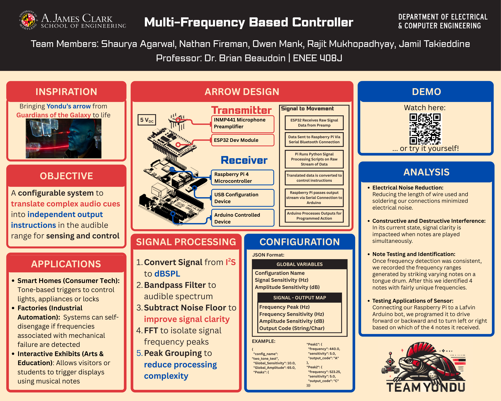

# YONDU — Multi-Frequency Based Controller

> Bringing Yondu's arrow from *Guardians of the Galaxy* to life:
> a configurable system that translates audio cues in the audible range into
> independent control instructions.

**Team Yondu** · ENEE 408J Capstone · University of Maryland, College Park · Spring 2025
Shaurya Agarwal · Nate Fireman · Owen Mank · Rajit Mukhopadhyay · Jamil Takieddine



## What this is

For our capstone we built a rover you drive with music. Strike a note on a
tongue drum and a wearable "fin" (INMP441 mic + ESP32) streams the raw audio
over Bluetooth to a Raspberry Pi, which FFTs the signal, matches frequency
peaks against a JSON config, and serial-commands an Arduino to spin the
motors — hit-to-wheel in under 200 ms. It survived a full day of strangers
driving it at the UMD Capstone Design Expo.

This repo is the complete record **plus a living demo**:

| | |
|---|---|
| 🕹 [`web/`](web) | **Live browser simulation** — calibrate to *your* whistle, then fly a glowing arrow with pitch alone. Pure static HTML/JS/CSS, no build step. |
| 🔩 [`hardware/`](hardware) | All firmware & software that ran the physical rover: ESP32 I2S transmitter, Raspberry Pi signal processor + configs, Arduino motor controller. |
| 📐 [`docs/HARDWARE.md`](docs/HARDWARE.md) | Full rebuild spec — BOM, wiring tables, pairing/setup steps, calibration procedure, lessons learned. |
| 🧠 [`docs/ARCHITECTURE.md`](docs/ARCHITECTURE.md) | Signal chains for both the rover and the browser sim. |
| 📄 [`docs/REPORT.md`](docs/REPORT.md) | The final capstone report ([poster PDF](docs/poster.pdf)). |

## The live demo

The original rover mapped **four discrete notes** to forward/back/left/right.
Our report proposed a *continuous control mode* as future work — whistle
intensity as speed, pitch direction as steering. The web demo implements
exactly that:

1. **Calibrate** — the app measures your room's noise floor, then has you
   whistle a steady note, sweep up, and sweep down. That builds your personal
   **whistle print**: `{ floor, center, min, max }`.
2. **Fly** — whistle at your center to thrust, slide higher to bank right,
   lower to bank left, go silent to coast. Louder = faster.
3. **Export** — download your print as a JSON in the same format as the
   rover's `config.json`, the conceptual bridge from sim back to hardware.

Pitch detection is McLeod-style normalized autocorrelation over 2048-sample
windows, restricted to the whistle band (350–4500 Hz) — the browser-native
cousin of the FFT peak matching the Pi ran. No audio ever leaves the page.

No microphone handy? **Autopilot demo mode** synthesizes a whistle through
the identical analysis pipeline.

### Run it locally

Any static server works:

```bash
cd web
python -m http.server 8080
# open http://localhost:8080  (mic requires localhost or HTTPS)
```

### Deploy

The demo is GitHub-Pages-ready: serve the repo with Pages and open `/web/`,
or point Pages at the `web/` folder. It embeds in any site as static files.

## The hardware, in one picture

```
tongue drum ~~~> INMP441 ──I2S──> ESP32 ──Bluetooth──> Raspberry Pi 4 ──USB serial──> Arduino UNO ──> motors
                  (mic)     (capture + transmit)    (FFT + config match)          (H-bridge actuation)
```

Want to build one? Start at [`docs/HARDWARE.md`](docs/HARDWARE.md).

## Credits

Built by Team Yondu for ENEE 408J (Prof. Brian Beaudoin), UMD ECE, Spring
2025. ESP32 I2S mic bring-up based on
[atomic14/esp32-i2s-mic-test](https://github.com/atomic14/esp32-i2s-mic-test).
Inspired by a certain whistling Ravager. 🏹
