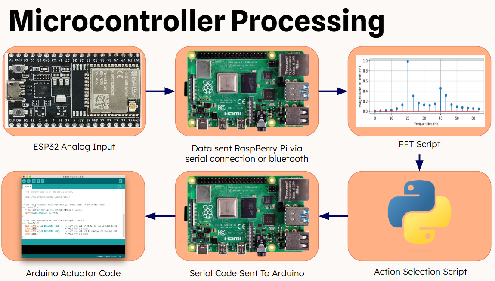

# Architecture

Two implementations of the same idea — *translate audio cues in the audible
range into independent control instructions* — one in hardware (the capstone
rover) and one in the browser (the live demo).

## Hardware signal chain (the rover)



```
INMP441 mic ──I2S──▶ ESP32 ──Bluetooth serial──▶ Raspberry Pi 4 ──USB serial──▶ Arduino UNO ──▶ DC motors
   (capture)        (acquire + transmit)        (FFT + decision)               (actuation)
```

1. **Capture** — INMP441 I2S MEMS mic, 48 kHz, 32-bit samples.
2. **Acquire/transmit** — ESP32 reads 512-sample I2S buffers and streams each
   sample as a text line over Bluetooth serial (`ESP32_Yondu`, 115200 baud).
3. **Process** (Raspberry Pi, Python):
   - convert the raw stream to dB SPL scale
   - band-pass filter (~20 Hz – 1 kHz) to the instrument's range
   - estimate the noise floor from signal RMS and subtract it
   - Hanning window + FFT (1024-sample windows) → magnitude peaks in dB
   - group peaks within ~5 Hz / 5 dB of each other to cut computation
   - match peaks against `config.json` (frequency ± sensitivity, amplitude
     threshold) → output codes
4. **Actuate** — Arduino receives newline-terminated codes and fires motor
   routines through H-bridge logic (PWM ≈ 128; slower for turns).

The decision layer is *entirely configuration-driven*: a JSON file maps
frequency bands to output codes, so retuning to a new instrument, room, or
machine requires no code changes (see `docs/HARDWARE.md` §4).

### Latency budget

Strike → wheels target was **< 200 ms**: ~21 ms of audio per FFT window at
48 kHz, a few ms of FFT on the Pi 4, and serial hops at 115200/9600 baud.

## Browser simulation (`web/`)

The demo implements the **Continuous Control Mode** we proposed in the report
as future work: instead of four discrete notes, the controller calibrates to
*your whistle* and derives continuous control from where your pitch sits in
your own whistle range.

```
getUserMedia ──▶ AnalyserNode ──▶ pitch detector ──▶ calibration/signature ──▶ gesture classifier ──▶ arrow physics
 (browser mic)   (time domain)    (autocorrelation)   (your whistle range)     (hold/up/down/quiet)    (canvas)
```

- **Pitch detection** (`js/audio-engine.js`) — normalized autocorrelation
  (NSDF-style) over 2048-sample windows with parabolic peak interpolation,
  searched only in the whistle band (350–4500 Hz). Whistles are nearly pure
  sine tones, so autocorrelation is extremely stable; an RMS gate plus a
  clarity threshold rejects speech and background noise. ~43 ms per frame at
  48 kHz — the same latency class as the hardware pipeline.
- **Calibration** (`js/calibration.js`) — a four-step "whistle signature":
  1. *Silence* — measure the room's noise floor (sets the RMS gate).
  2. *Steady whistle* — median voiced pitch → your center frequency.
  3. *Sweep up* — 90th-percentile pitch → top of your range.
  4. *Sweep down* — 10th-percentile pitch → bottom of your range.
  The result `{ floor, center, min, max }` is your personal print. It can be
  downloaded as a JSON file in the same shape as the hardware `config.json`
  (frequency + sensitivity + output code per band), so a signature calibrated
  in the browser is conceptually portable to the rover.
- **Gesture classification** (`js/gestures.js`) — pitch is mapped to a
  log-scale position `p ∈ [−1, +1]` inside your calibrated range, median
  filtered over recent frames with hysteresis on the class boundary:
  | Gesture | Condition | Effect |
  |---------|-----------|--------|
  | HOLD | whistling, `p` near center | thrust forward |
  | PITCH UP | `p` above the dead zone | thrust + turn right |
  | PITCH DOWN | `p` below the dead zone | thrust + turn left |
  | SILENCE | RMS below gate | coast / hover |
  Loudness above the gate scales thrust — whistle harder, fly faster.
- **Arrow** (`js/arrow.js`, `js/sim.js`) — a canvas-rendered arrow with an
  additive-blended crimson trail (the closest a 2D canvas gets to yaka-arrow
  plasma), steered by the gesture stream through simple momentum physics.
- **Demo mode** — an `OscillatorNode` synthesizes whistle patterns through the
  identical analysis path, so the full pipeline (detection → calibration →
  gestures → flight) runs and can be verified without a microphone.

Everything is dependency-free vanilla JS — no build step, hostable on GitHub
Pages or embeddable in a personal site as static files.

## Design rationale (from the report)

- **Why a Pi for DSP** — the Arduino lacks memory/compute for real-time FFT;
  the ESP32 offloads capture; the UNO is a cheap, reliable actuator.
- **Why config files** — adaptability to any environment without code edits.
- **Alternatives considered** — bandpass-filter-only detection (simpler, less
  precise), an ML note classifier (more robust, impractical for real-time
  embedded), and continuous control (now realized by this demo).
