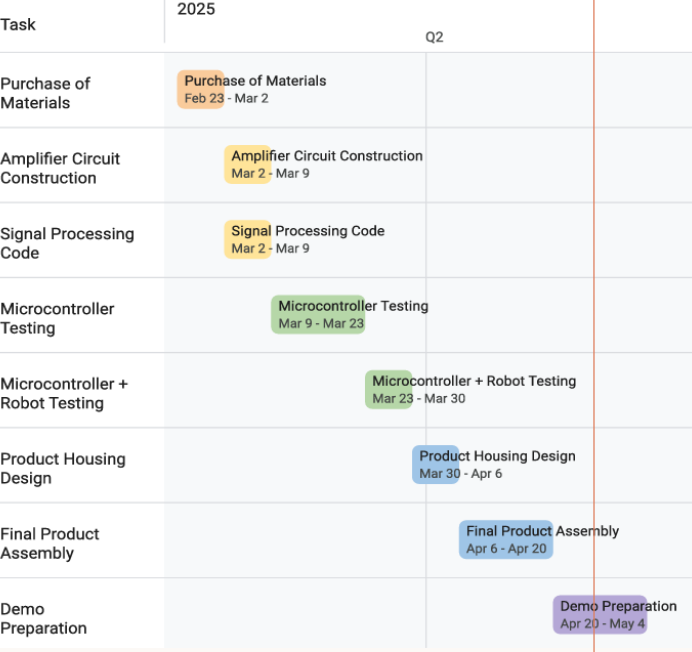
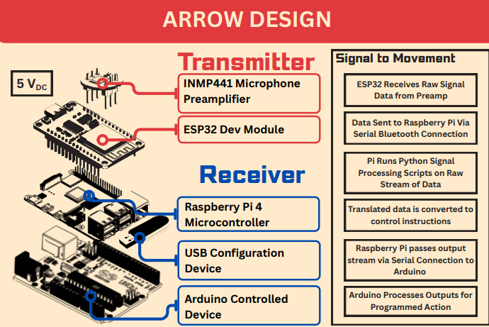

# Team Yondu — Final Capstone Report

**University of Maryland, College Park — Department of Electrical and Computer Engineering**
ENEE 408J · Spring 2025 · Professor Brian Beaudoin

**Team:** Shaurya Agarwal · Nate Fireman · Owen Mank · Rajit Mukhopadhyay · Jamil Takieddine

> Markdown conversion of the original submission (May 15, 2025). Code from the
> appendix lives in [`hardware/`](../hardware) as flashable/runnable source.
> The expo poster is [`poster.pdf`](poster.pdf).

## Contributions

- **Shaurya Agarwal** — Construction of the rover, adding/calibrating motors, wiring/placing components and writing Arduino code.
- **Nathan Fireman** — Construction of the rover and accompanying mechanical pieces, CAD (Yondu fin) lead and design of Arduino code.
- **Owen Mank** — Finding and procuring materials needed to implement our design, helping set up ESP32–Raspberry Pi connection, electrical assembly, poster content.
- **Rajit Mukhopadhyay** — Raspberry Pi setup, signal processing code, configuration code, poster design and content, signal processing calibration/testing, full system calibration/testing.
- **Jamil Takieddine** — ESP32–Raspberry Pi connection setup, Arduino code modifications, frequency range calculations for optimal vehicle maneuvers, poster design.

## Executive Summary

The goal of Team Yondu's capstone design project was to develop an autonomous
system capable of recognizing and responding to distinct audio stimuli. The
project followed a structured development path, beginning with brainstorming
and concept validation, progressing through individual subsystem testing,
debugging, and ultimately full system integration and assembly. Key design
decisions involved selecting appropriate microphone, Bluetooth, and computing
modules, defining the rover's mechanical form and speed characteristics, and
optimizing parameters such as audio sampling rate and system response time.

The project's success at the Capstone Design Expo reflects the effectiveness
of these decisions, though opportunities for refinement remain. Challenges
encountered throughout the semester included initial flaws in the rover
chassis design, malfunctioning components, and environmental signal
interference. These issues were addressed through iterative troubleshooting,
guided by a detailed Gantt chart and a structured testing plan that ensured
consistent progress toward project milestones.

Simulation and hands-on testing informed several design adjustments and
validated system functionality, while final prototyping confirmed the
system's ability to meet design specifications under real-world conditions.
Future improvements could enhance robustness, expand stimulus detection
capability, and improve response time and efficiency.

## Introduction

Team Yondu set out to build an audio-driven rover inspired by Yondu's arrow
from *Guardians of the Galaxy* — but controlled by a drum instead of
whistles. We used a tongue drum to play four different notes which
corresponded to forward, backward, left and right; each movement was mapped
to a unique note. A microphone on an ESP32 captured the audio, streamed it to
a Raspberry Pi for frequency analysis, and motion commands were then sent to
an Arduino, which controlled the rover's DC motors.

## Goals and Design Overview

**Goals:**

- **Note-to-motion mapping** — extract one of four drum frequencies despite ambient noise.
- **Maneuver terrain** — tackle the challenges of driving through rough terrain.
- **Signal processing** — convert signal from I2S to dB SPL, apply a bandpass filter, subtract the noise floor, and Fourier transform for frequency peaks.
- **Low-latency response** — achieve hit-to-wheel delay under 200 ms so the rover reacts in time with the drum.
- **High detection accuracy** — correctly classify each drum hit with high accuracy in noisy environments.
- **Safe and repeatable operation** — protect electronics with proper fusing and standardized electrical practices.

**Components:**

- **Lafvin 2WD Robotic Kit** — body of the rover, with motors driving the front two wheels and a back wheel that helps in turning.
- **Raspberry Pi 4** — signal processing of the audio picked up by the microphone.
- **INMP441 microphone** — collects raw audio signals from the environment.
- **ESP32 DEV Module** — transmission of audio signals to the Raspberry Pi.
- **5 V / 2 A portable batteries** — power the rover, Raspberry Pi, and ESP32.
- **Prototyping board** — quick, solid connection between the INMP441 and ESP32 while keeping the INMP441 replaceable.

The physical design, nicknamed **"the arrow,"** consists of two parts: the
transmitter and the receiver. The transmitter comprises an INMP441 microphone
preamplifier and an ESP32 Dev Module; the ESP32 receives raw signal data from
the preamplifier. The data is sent over Bluetooth to the receiver — a
Raspberry Pi 4, a USB configuration device, and an Arduino UNO. The Pi runs a
Python signal-processing script on the raw stream, converts the result into
control instructions in the form of letters (A, B, C, D), and sends that
output stream over serial to the Arduino, which executes the programmed
movement (A = forward, B = backward, C/D = turns).

In signal processing, the Raspberry Pi first converts the raw I2S signal
received over the Bluetooth virtual serial connection to dB SPL format. The
signal passes through a band-pass filter calibrated between 20 Hz and 1 kHz
to narrow the range of raw audio. The noise floor is approximated using the
RMS of the signal and subtracted out for noise reduction. The FFT of the
signal is then taken to collect peaks; peaks within a calibrated proximity
and intensity of each other (typically 5 Hz and 5 dB) are grouped to reduce
computational overhead. Based on an input configuration file, these peaks and
intensities are mapped to output instructions transmitted to the connected
output device via direct serial connection.

## Realistic Constraints and Challenges

**Audio overlap and interference** — frequency detection was disrupted when
multiple notes were struck simultaneously, causing constructive and
destructive interference [1]. This made it difficult to isolate a single
dominant frequency. We limited user input to one note at a time and
instructed consistent single-note strikes during operation.

**Note differentiation** — some tongue-drum notes produced similar or
overlapping frequency ranges. We selected four notes with well-separated
frequency ranges (measured through testing for the most consistent readings)
to ensure reliable detection and reduce misclassification.

**Environmental noise sensitivity** — lab testing had minimal ambient noise,
but the expo would not. We tested the robot against subway white-noise
ambience in the background, improving reliability irrespective of
environment.

**Control signal consistency** — whistling specific frequencies accurately is
difficult. We generated our control audio with an instrument instead. A
sustaining instrument (recorder, violin) would have been preferred for its
steady volume [2], but we selected a non-sustaining tongue drum for the expo
so anyone could demo it without worrying about sanitation or skill. Since a
drum strike decays in volume, we tuned when and how long the device sampled.

## Engineering Standards

The rover movement code was written in the Arduino environment. All hardware
pins are declared at the top of the sketch using `#define` and `const` to
avoid dynamic memory allocation. On power-up, `setup()` calls the stop
command so the robot remains stationary while initialization completes;
direction pins default to LOW to prevent unintended motion. Each command is
tied to specific functions, and `Serial.println()` provides real-time debug
statements throughout motor actions. Each motor control was individually
tested ([code](../hardware/arduino/yondu_rover/yondu_rover.ino)).

The signal-processing and audio-manipulation code was written in Python,
organized into functions for receiving audio, pre-processing, processing, and
output organization — a single Python file referencing a configuration file
stored on an external flash drive
([code](../hardware/raspberry-pi/signal_processor.py)).

## Design Choices and Alternative Designs

**Arduino UNO (robot actuation)** — chosen for reliability, easy integration
with the motor drivers, and suitability for straightforward actuator
commands. Its role is limited to executing one of four movement instructions,
making it efficient and cost-effective.

**ESP32 (audio acquisition & transmission)** — interfaces with the INMP441
I2S microphone and transmits raw audio over Bluetooth to the Pi. Chosen for
native I2S support, wireless capability, and offloading signal capture from
the Pi. It was also available to the team from the lab at the start of the
semester.

**Raspberry Pi (signal processing & decision logic)** — the central
processor: receives audio via Bluetooth, applies FFT, and maps frequencies to
movement commands. The Arduino was rejected for this role because it lacks
the compute and memory for efficient real-time audio analysis and FFT, which
the Pi handles easily in its Linux environment.

**Configuration files** — the Pi probes frequencies based on a configuration
file with global parameters for decibel and frequency sensitivity, mapping
frequency ranges to output codes. This makes the design adaptable to
different environments and quickly changeable by any user without modifying
code on the Pi.

**Microphone placement** — we initially placed the microphone and ESP32
assembly *inside* the drum to ensure strikes were captured, but resonance
amplified speech frequencies matching drum notes and caused false
triggers [3]. The assembly was moved outside the drum.

**Alternatives considered:**

- *Bandpass-filter-only detection* — multiple filters each tuned to a note's
  range; computationally simpler but lacks the precision, scalability, and
  signal clarity of bandpass-as-preconditioning + FFT.
- *Machine-learning classifier* — a lightweight neural network classifying
  notes from extracted features; potentially more noise-robust but requiring
  data collection, training, and complexity impractical for fast real-time
  control on embedded hardware.
- *Continuous control mode* — instead of notes mapping to directions, "on"/
  "off" notes enter a continuous mode where whistle intensity correlates to
  speed, pitching up turns one direction, pitching down the other, and
  silence stops. **This concept is now implemented in the browser demo in
  [`web/`](../web).**

## Design Validation for Systems and Subsystems

The system consists of three primary components operating in a live loop from
audio input to physical movement with minimal latency:

- **Signal acquisition (ESP32)** — captures raw audio via an omnidirectional
  I2S microphone and transmits to the Pi via Bluetooth serial
  (`/dev/rfcomm0`) at 115200 baud, selected for wireless flexibility and
  reliable indoor performance with low latency.
- **Processing (Raspberry Pi)** — receives the serial stream, performs
  FFT-based processing to identify prominent frequency peaks, converts peak
  data to decibel scale, filters background noise with a configurable
  sensitivity threshold, and maps frequencies to note identifiers from a JSON
  configuration file. Identifiers are transmitted via a second serial channel
  to the Arduino.
- **Control (Arduino + motors)** — receives newline-terminated command
  strings via `readStringUntil('\n')`. On a valid command (`A`, `B`, `C`,
  `D`, `0`), it triggers a motion routine driving four motor-control pins
  (two per motor) through H-bridge logic. PWM speed is fixed mid-range (128)
  for steady, controllable movement.

## Test Plan

Testing proceeded in three phases:

**Phase 1 — ESP32 ↔ Raspberry Pi communication:**
- `bluetoothctl` on the Pi to automate pairing with the ESP32 at startup.
- A test script simulating data transmission to verify the serial port.
- Monitoring real-time data flow for continuity — no buffer overruns, signal
  loss, or timeouts.
- Tests at various distances and orientations for practical deployment
  stability.

**Phase 2 — signal-processing accuracy:**
- Playing known sine test tones (500 Hz, 1000 Hz, 1500 Hz) from a signal
  generator into the microphone system.
- Running FFT analysis on received samples.
- Verifying detected peak frequencies aligned with known inputs within an
  acceptable margin of error.

**Phase 3 — drum-note characterization:**
- Repeated strikes of each drum pad under varying angle and intensity.
- Logging detected peak frequencies and measuring variance between hits.
- Establishing confidence intervals per frequency signature; identifying the
  most stable, distinguishable bands.
- Assigning control outputs in the configuration file based on frequency
  uniqueness and reproducibility.

This calibrated the configuration file so each drum pad triggered a specific
output code even amid environmental noise and hit-intensity variation.

## Project Planning and Management

Development was tracked with a Gantt chart to align hardware and software
progress. Material purchases began at the end of February; amplifier circuit
work (ultimately the INMP441 purchase) and signal-processing code development
followed in early March. Microcontroller testing — the ESP32↔Pi connection
and Pi configuration — ran the following weeks and took longer than
anticipated, absorbed by planned buffer time. Integration culminated in robot
testing phases validating hardware and embedded software together.

In the final weeks before the expo we designed the vehicle housing — the
**fin**, in honor of Yondu — which housed the ESP32 and INMP441 so audience
members could "drive" the robot by wearing the fin and moving near the tongue
drum as they struck notes. The final week was dedicated to demo preparation
and poster design.

## Conclusions

Working on the Yondu project gave the team the opportunity to act on four
years of experience in the A. James Clark School of Engineering, with each
member contributing expertise in a sub-category of electrical and computer
engineering.

We faced many challenges designing the Yondu fin/arrow: Bluetooth
interference, Pi↔Arduino communication issues, mechanical rover issues, and
more. Most were solved by changing approach — when the rover could not turn
accurately due to the Pi's sampling behavior, we reduced turn speed, making
turns slower and more correlated to the note played, which let expo
participants control the robot far more accurately.

Persistence and a change of mindset usually produced a solution — the most
important lesson we take into our professional careers: remain flexible and
malleable in thinking; no problem faced has no solution.

## References

1. R. Gibson, "Section 5.2: The Hamiltonian," University of Connecticut Department of Physics. https://www.phys.uconn.edu/~gibson/Notes/Section5_2/Sec5_2.htm
2. Steinberg, "Sustaining and non-sustaining instruments," Dorico Help. https://archive.steinberg.help/dorico/v3/en/dorico/topics/notation_reference/notation_reference_dynamics/notation_reference_dynamics_playback_sustain_nonsustain_c.html
3. Science Learning Hub, "Sound – resonance." https://www.sciencelearn.org.nz/resources/2815-sound-resonance
4. atomic14, "i2s_mic_test.ino," GitHub. https://github.com/atomic14/esp32-i2s-mic-test/blob/main/i2s_mic_test/i2s_mic_test.ino
